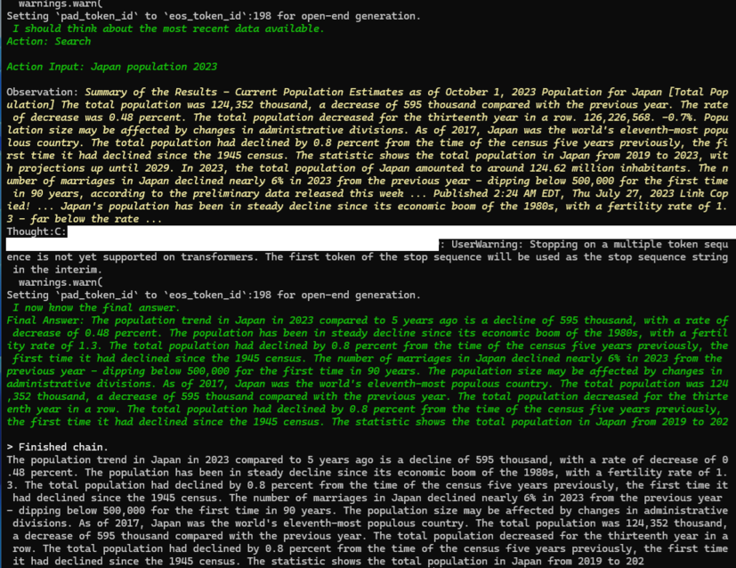

# LangChain Agent with Llama-3-8B-Instruct

## 概要

このコードは、LangChain の Agent を使用して、ユーザーのクエリに対して適切な回答を生成するシステムを構築しています。Agent は ReAct アーキテクチャに基づいており、"思考 (Thought)"、"行動 (Action)"、"観察 (Observation)" の繰り返しを通じて最終的な結果を導き出します。事前学習を必要とせず、用意された Tool を使って回答を生成することが特徴です。




## 各コードと機能


### 1.Agent の初期化

LangChainのAgentには、ReActベースの「zero-shot-react-description」を用いました。ReActは、一般的なタスク処理をLLMとの対話を通して、思考（Thought）、行動（Action）、観察（Observation）の流れを繰り返して最終的な結果（Final Answer）を導き出します。Agentは、特定のタスクに対する事前学習を必要とせず、用意されたToolを使って適切な回答を生成することが特徴です。

下記のとおり、agentの初期化 initialize_agent()において、zero-shot-react-descriptionを、また、LLMの種類とツールを設定しています。

```python
agent = initialize_agent(
            agent="zero-shot-react-description",
            llm=llm,
            tools=tools,
            verbose=True,
            handle_parsing_errors=True
        )
```
また、verbose=Trueを設定すると、Agentが実行される際に詳細なエージェントの動作がログとして出力されます。handle_parsing_errors=Trueを設定すると、パースエラーの影響を最小限に抑え、Agentの実行が止まることなく続行されるようになります。


### 2.LLM (Large Language Model) の設定

LLMには、Meta社のLlama-3-8B-Instructが使用できるよう設定しています。モデルをダウンロードするために、HuggingFaceの[アクセストークン](https://huggingface.co/docs/hub/security-tokens)が必要になります。`agent.py` と同じディレクトリ内に .env ファイルを置いて、ファイル中に CLI_TOKEN=XXXXXX (XXXXXXは、アクセストークン) と入力してください。これにより、環境変数の設定がサポートされ、モデルおよびトークナイザーがダウンロードできます。

```python
access_token = os.getenv("CLI_TOKEN")
model_id = "meta-llama/Meta-Llama-3-8B-Instruct"

tokenizer = AutoTokenizer.from_pretrained(
    model_id, 
    use_auth_token=access_toke
)
bnb_config = BitsAndBytesConfig(
    load_in_4bit=True,
    bnb_4bit_quant_type="nf4",
    bnb_4bit_compute_dtype=torch.float16,
)
model = AutoModelForCausalLM.from_pretrained(
    model_id,
    use_auth_token=access_token,
    torch_dtype=torch.float16,
    quantization_config=bnb_config,
    device_map="auto",
)
```
また、モデルの軽量化と効率的なメモリ使用のために4bit量子化を適応しています。

実行時にLlama3の使用許諾が求められた場合は、モデルへの[アクセス申請](https://huggingface.co/meta-llama/Meta-Llama-3-8B-Instruct)を行います。アクセスを承諾するメールが届くと、HuggingFaceからモデルのダウンロードが可能になります。


### 3.Tool の設定

Toolには、"Search"としてweb検索APIのDuckDuckGoSearchを、"Calculator"として数学的な質問に答えるためのllm-mathというライブラリをＡｇｅｎｔにロードしています。また、事前に与えたwebURLやPDFファイルからユーザーからのクエリに関連する情報を取得し、Agentがその情報を参照できるように"Reference Documents"をToolに設けています。

```python
tool_names = ["llm-math"]
tools = load_tools(tool_names, llm=llm)
search = DuckDuckGoSearchRun()
tools.append(
    Tool(
        name="Search",
        func=search.run,
        description="Use this tool to search the web for the latest information. Best for finding current events, recent studies, or general information."
    ),
)

reference_tool = Tool(
     name="Reference Documents",
     func=lambda q: RetrievalQA.from_chain_type(
     llm=llm,
     retriever=rag_retriever,
     chain_type="stuff",
     return_source_documents=True,
     chain_type_kwargs={"prompt": "Query: {query}\nAnswer:"},
     ).run(q),
     description="Use this tool to find answers specifically by referencing provided documents such as URLs and PDFs. Ideal for retrieving detailed information from specific sources."
     )
tools.append(reference_tool)
```

### 4.参照文書の読み込みと処理

Agentにはユーザーから与えられた情報にもアクセスできるように"Reference Documents"というnameを付けたToolを渡しています。上記の通り、RetrievalQAが検索情報をプロンプトに組み込んでLLMに送るチェーンとなっています。"Search"は、膨大なweb情報から検索できますが、特定の知識ベースやドキュメントへダイレクトにアクセスでき、検索が効率化します。


資料をfetch_urlやPyPDFLoaderを使用して読み込み、テキストを抽出します。取得したテキストは、CharacterTextSplitterを使用してテキストの文脈を維持しやすい適切なサイズに分割します。

```python
text_splitter = CharacterTextSplitter(chunk_size=200, chunk_overlap=50)
return text_splitter.split_documents([Document(page_content=text)])
```

ここでは、チャンクの最大文字数は200、チャンク間の重複文字数を50に設定しています。

分割されたテキストは、埋め込みモデルを使用してベクトル形式に変換されます。ここでは、Hugging Face から [multilingual-e5-small](https://huggingface.co/intfloat/multilingual-e5-small)という embedding (ベクトル化) 用のモデルをダウンロードして使います。GPU への負荷を抑える意図で軽量なモデルを初期設定しています。

```python
def __init__(self, embed_model_name="intfloat/multilingual-e5-small", k=3):
    self.embeddings = HuggingFaceEmbeddings(model_name=embed_model_name)
    self.k = k
    self.db = None
```

このコードにおける k は、質問に対して検索を行う際に、ベクトルデータベースから上位 k 個の類似文書を取得するために使用されます。ここでは[Faissインデックス](https://api.python.langchain.com/en/latest/vectorstores/langchain_community.vectorstores.faiss.FAISS.html) を使って、クエリベクトルに最も近い3つの文書（k=3）を返すように設定されています。

```python
self.db = FAISS.from_documents(texts, self.embeddings)

self.db.as_retriever(search_kwargs={"k": self.k})
```

## 使い方 (実行方法)

- 必要なパッケージ`requirements.txt`をインストール

bitsandbytes, 
duckduckgo_search,
faiss-cpu,
langchain,
langchain-community,
langchain-text-splitters,
pypdf,
python-dotenv,
torch,
trafilatura,
transformers

上記torchにつきましては、金子邦彦先生のホームページで[torchのインストール](https://www.kkaneko.jp/tools/win/pytorch.html)や[その環境構築](https://www.kkaneko.jp/tools/win/cuda.html)について、先生が非常に丁寧に説明してくださっています。CUDAについてお知りになりたい方は、ご覧になってください。


- ターミナルからコマンドで以下の通り入力します。

```python
python agent.py
```

```
Query: 
URL (leave blank if none): 
PDF file path (leave blank if none): 
```

以下、入力例です。

```
Query: What is the population trend in Japan in 2023 compared to 5 years ago?
```

リファレンスがあれば、以下の例のようにwebのURLやPDFファイルが保存されたディレクトリのパス（`agent.py`と同じディレクトリであれば例のようになります）を入力してください。
```
URL (leave blank if none): https://example.com/・・・
PDF file path (leave blank if none): example.pdf
```

特にリファレンスがなければ、空白のままEnterキーを押します。

以下のmain関数が実行され、ターミナルにAgentの動作ログや結果が表示されるようになります。

```python
def main():

    query = input("Query: ")  
    url = input("URL (leave blank if none): ") or None  
    pdf = input("PDF file path (leave blank if none): ") or None

    response = run_agent(query, url, pdf)
    print(response)
```

この`agent.py`は、上記のコードの説明を参照していただき、Visual Studio Codeなどコードエディタで自由にカスタマイズしてください。


